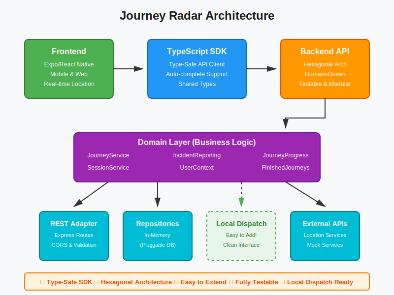

# Journey Radar Architecture Highlight

## Visual Overview

## Key Strength

**The Journey Radar system features a type-safe TypeScript SDK and a backend built with hexagonal architecture, creating clean separation between domain logic and infrastructure adapters. This thoughtful design makes adding new capabilities—such as local dispatch systems—a straightforward task, requiring only a new adapter implementation without touching core business logic.**

---

## Why This Matters

- **Type-Safe SDK**: Auto-completion, compile-time errors, and shared types between frontend and backend
- **Hexagonal Architecture**: Domain logic isolated from infrastructure concerns
- **Pluggable Design**: New adapters (like local dispatch) can be added without modifying existing code
- **Testable**: Each layer can be tested independently with mocked dependencies
- **Maintainable**: Clear boundaries make the codebase easy to understand and evolve

## Example: Adding Local Dispatch

To integrate a local dispatch system, you would simply:

1. Create a new adapter implementing the domain interfaces
2. Wire it up in the application layer
3. The SDK and domain logic remain unchanged

This is the power of hexagonal architecture in action.

